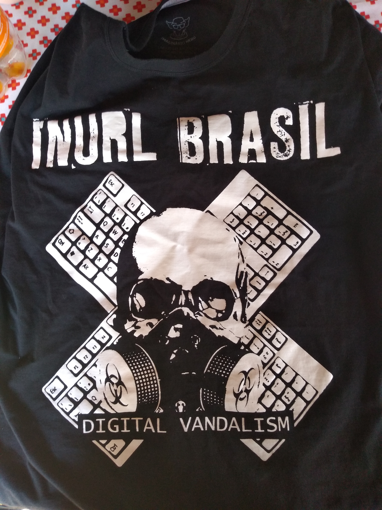
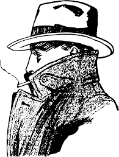
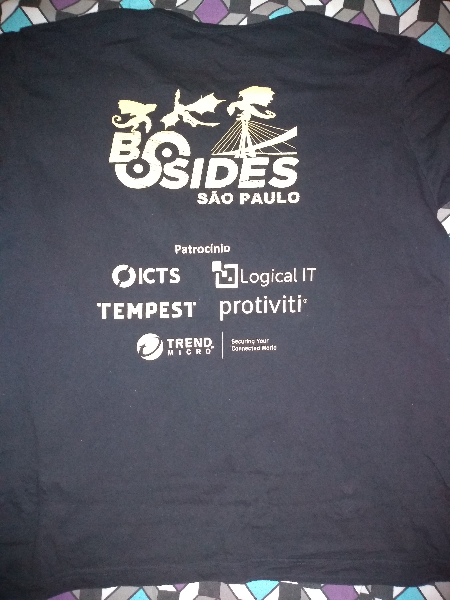
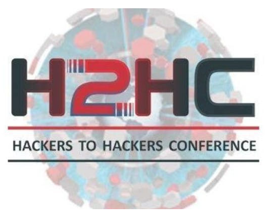

# camisa-village
Projeto da camisa da village da h2hc

## Frente

### Referencia
Essa é uma referencia, o nome do projeto em cima e a logo abaixo.

> Nesse caso o projeto da referencia se chama INURL Brasil

### Ideia
Frente vai ser algo semelhante a essa imagem abaixo, com o o nome do projeto acima.

> O nome do projeto é OSINT Village

## Atras

### Referencia
Vamos usar como referencia a camisa da bsides

> Podemos ver o nome da edição e os apoiadores

### Ideia
A ideia é inves de bsides São Paulo vamos ter **OSINT Village H2HC Edition**.

Já nos apoiadores vamos colocar a **H2HC** que tambem está ajudando nas camisas e o nome do coletivo.

